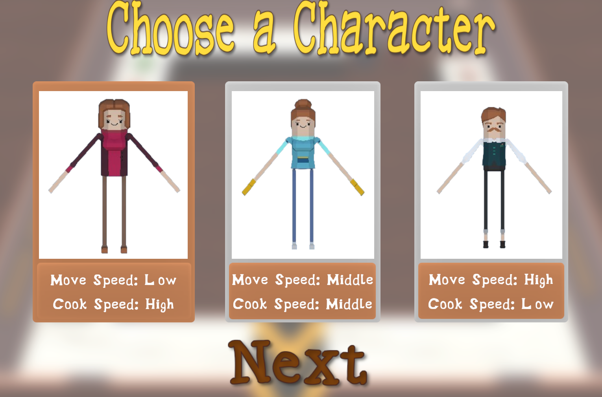
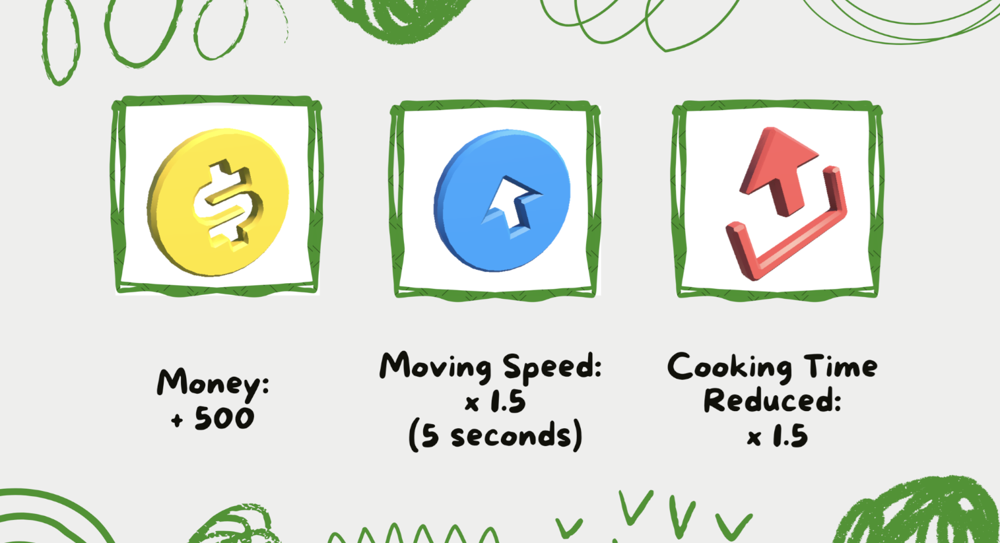
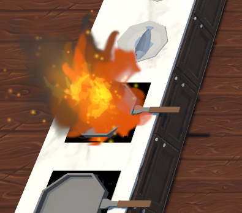
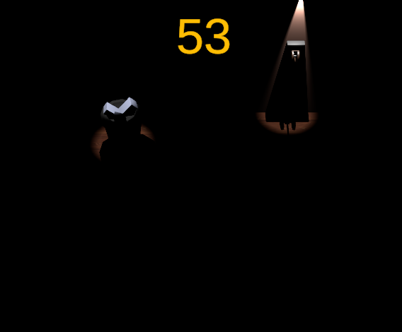

# Hell's Kitchen

## Overview

The primary goal is to prepare and serve food orders accurately and efficiently within a set time limit while managing 
hazards like kitchen fires and power outages and earn a target amount of money. 

Primary Objectives
● Progressing through increasingly complex levels by completing all food orders before the timer runs out.
● Overcoming kitchen hazards (fires, power outages) while maintaining efficiency.
● New goal: Get a certain score in the current stage to advance to a more difficult stage.

## Tech Stack
Unity 2023.2.20

## Usage

- You can choose 3 different types of characters having different stat.

  

- These items appear in the kitchen. If you get them, you wil get corresponding rewards.

  
  

- you will encounter these obstacles to get over.

